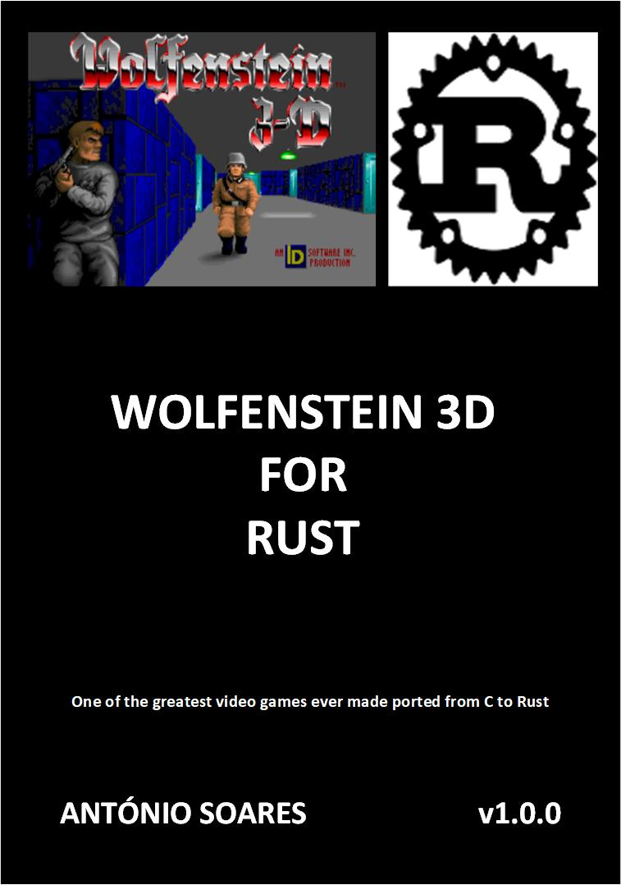

# Wolf4Rust v1.0.0

## Description



This port is based on Wolf4SDL by Moritz "Ripper" Kroll and others.

* [Wolf4SDL](https://github.com/11001011101001011/Wolf4SDL)

Original Wolfenstein 3D by id Software:

* [Wolfenstein 3D](https://github.com/id-Software/wolf3d)

This book helps understanding many of the internals of the original game:

* [Game Engine Black Book: Wolfeinstein 3D 2nd Edition](https://fabiensanglard.net/gebbwolf3d/)

## Dependencies

* [Rust-SDL2](https://github.com/Rust-SDL2/rust-sdl2)
* [ADPlug](https://github.com/adplug/adplug)


## Build and run

### Install SDL2/SDL2-Mixer:

#### Ubuntu

sudo apt install libsdl2-dev

sudo apt install libsdl2-mixer-dev

#### CentOS

sudo dnf --enablerepo=powertools install SDL2

sudo dnf --enablerepo=powertools install SDL2-devel

sudo dnf --enablerepo=powertools install SDL2_mixer

sudo dnf --enablerepo=powertools install SDL2_mixer-devel

### Compile and install fmopl:

$ cd src/mame

$ cc -c fmopl.c

Create Dynamic lib

$ cc -shared fmopl.o -o libfmopl.so

Create Static lib

$ ar rcs libfmopl.a fmopl.o

#### Ubuntu
\# cp libfmopl.so /usr/lib/x86_64-linux-gnu

\# cp libfmopl.a /usr/lib/x86_64-linux-gnu

#### CentOS
\# cp libfmopl.so /usr/lib/

\# cp libfmopl.a /usr/lib/


### In Cargo, choose feature UPLOAD or GOODTIMES depending if you have the WL1 or WL6 files

WL1 Files (Episode 1 Shareware):

audiot.wl1
config.wl1
gamemaps.wl1
maphead.wl1
vgadict.wl1
vgagraph.wl1
vgahead.wl1
vswap.wl1

WL6 Files (Episodes 1 to 6):

audiot.wl6
config.wl6
gamemaps.wl6
maphead.wl6
vgadict.wl6
vgagraph.wl6
vgahead.wl6
vswap.wl6

```
cargo build --release

cargo run --release

BOSS Levels:

cargo run -- --easy --tedlevel 8
cargo run -- --easy --tedlevel 18
cargo run -- --easy --tedlevel 28
cargo run -- --easy --tedlevel 38
cargo run -- --easy --tedlevel 48
cargo run -- --easy --tedlevel 58

```

## Controls

| Key(s)               | Action            |
| -------------------- | ----------------- |
| Up Arrow             | `Move Forward`    |
| Down Arrow           | `Move Backward`   |
| Left Arrow           | `Turn Left`       |
| Right Arrow          | `Turn Right`      |
| Shift + Up Arrow     | `Run Forward`     |
| Shift + Down Arrow   | `Run Backward`    |
| Shift + Left Arrow   | `Fast Left Turn`  |
| Shift + Right Arrow  | `Fast Right Turn` |
| Alt + Left Arrow     | `Strafe Left`     |
| Alt + Right Arrow    | `Strafe Right`    |
| Ctrl                 | `Fire`            |
| Space Bar            | `Open Doors`      |

## Limitations

Use X11 instead of Wayland. SDL2 set_relative_mouse_mode doesn't work with Wayland.
If you use VMWare, set vmmouse.present = "FALSE", otherwise set_relative_mouse_mode doesn't work properly.

https://github.com/libsdl-org/SDL/issues/1836

## Author

* [Antonio Soares](https://github.com/ccie18473)

## License

This project is licensed under the [MIT] License - see the LICENSE.md file for details

The Wolfenstein textures are copyrighted by id Software.